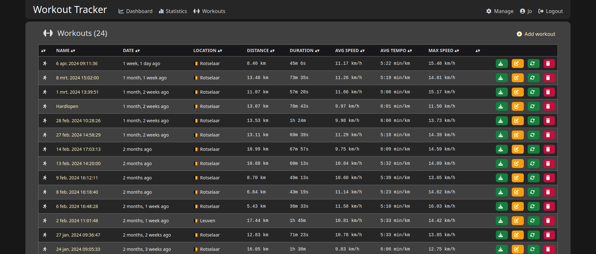

A workout tracking web application for personal use (or family, friends), geared towards running and other GPX-based
activities

Self-hosted, everything included.

Heavily inspired by [FitTrackee](https://github.com/SamR1/FitTrackee) :heart:.

## Getting started

### Docker

Run the latest master image from GitHub Container Registry:

```bash
docker run -p 8080:8080 ghcr.io/jovandeginste/workout-tracker:master
```

Open your browser at `http://localhost:8080`

To persist data and sessions, run:

```bash
docker run -p 8080:8080 \
    -e WT_JWT_ENCRYPTION_KEY=my-secret-key \
    -v $PWD/data:/data \
    ghcr.io/jovandeginste/workout-tracker:master
```

### Natively

Download a pre-built binary or build it yourself (see [Development](#development) below).

```bash
wget https://github.com/jovandeginste/workout-tracker/releases/download/v0.2.2/workout-tracker-v0.2.2-linux-amd64.tar.gz
tar xf workout-tracker-v0.2.2-linux-amd64.tar.gz
./workout-tracker
```

To persist sessions, run:

```bash
export WT_JWT_ENCRYPTION_KEY=my-secret-key
./workout-tracker
```

This will create a new database file in the current directory and start the web server at `http://localhost:8080`.

## Screenshots

### Dashboard


Dashboard view with:

- personal totals
- running records
- a calendar view
- recent activities (by you and other users)

### Overview of workouts


Overview of all your activities, with summaries. The columns are sortable.

### Details of a single workout


Details of a workout, with:

- a zoomable, dragable map of the GPX track with more details per point
- many summarized statistics
- a breakdown per kilometer

### Tooltips for even more information


- green and red circle are start and end points of the track
- every point on the track has a tooltip with a summary at that moment


### Upload your files


Upload one or multiple GPX files.
The files are parsed when uploaded, statistics and other information are calculated and stored in the database (serialized).

## Configuration

The web server looks for a file `workout-tracker.yaml` (or `json` or `toml`) in the current directory, or takes it's
configuration from environment variables. The most important variable is the JWT encryption key. If you don't provide
it, the key is randomly generated every time the server starts, invalidating all current sessions.

Generate a secure key and write it to `workout-tracker.yaml`:

```bash
echo "jwt_encryption_key: $(pwgen -c 32)" > workout-tracker.yaml
```

See `workout-tracker.example.yaml` for more options and details.

After starting the server, you can access it at <http://localhost:8080> (the default port). A login form is shown.

If no users are in the database (eg. when starting with an empty database), a default `admin` user is created with
password `admin`. You should change this password in a production environment.

## Development

### Build and run it yourself

- install go
- clone the repository

```bash
go build ./
./workout-tracker
```

This does not require npm or Tailwind, since the compiled css is included in the repository.

### Do some development

You need to install Golang and npm.

Because I keep forgetting how to build every component, I created a Makefile.

```bash
# Make everything. This is also the default target.
make all # Run tests and build all components

# Install system dependencies
make install-deps

# Testing
make test # Runs all the tests
make test-views test-assets test-go # Run tests for the individual components

# Building
make build # Builds all components
make build-tw # Builds the Tailwind CSS output file
make build-server # Builds the web server
make build-docker # Performs all builds inside Docker containers, creates a Docker image

# Running it
make serve # Runs the compiled binary
make dev # Runs a wrapper that watches for changes, then rebuilds and restarts
make watch-tw # Runs the Tailwind CSS watcher (not useful unless you're debugging Tailwind CSS)

# Cleanin' up
make clean # Removes build artifacts
```

## What is this, technically?

A single binary that runs on any platform, with no dependencies.

The binary contains all assets to serve a web interface, through which you can upload your GPX files, visualize
your tracks and see their statistics and graphs. The web application is multi-user, with a simple registration and
authentication form, session cookies and JWT tokens). New accounts are inactive by default. An admin user can activate
(or edit, delete) accounts. The storage is a single SQLite database.

## What technologies are used

- Go, with some notable libraries
  - [gpxgo](github.com/tkrajina/gpxgo)
  - [Echo](https://echo.labstack.com/)
  - [Gorm](https://gorm.io)
- HTML, CSS and JS
  - [Tailwind CSS](https://tailwindcss.com/)
  - [Font Awesome](https://fontawesome.com/)
  - [FullCalendar](https://fullcalendar.io/)
  - [Leaflet](https://leafletjs.com/)
  - [sorttable](https://www.kryogenix.org/code/browser/sorttable/)
- Docker

## TODO

- write tests!!!!!
- aggregated statistics and graphs
  - eg. number of kilometers per month
- add support for authentication through a reverse proxy
- internationalization
- provide a light theme
- add more activity types
- see if htmx is worth using
- make a dev-flag that doesn't embed all files in the binary
- add support for generic database drivers
- add support for other types of import files (eg. Garmin fit files)
- add support for auto-import from a folder (per user)
